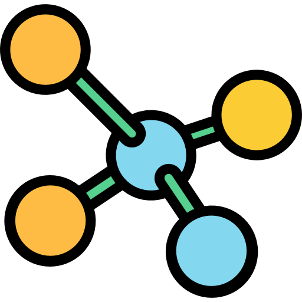
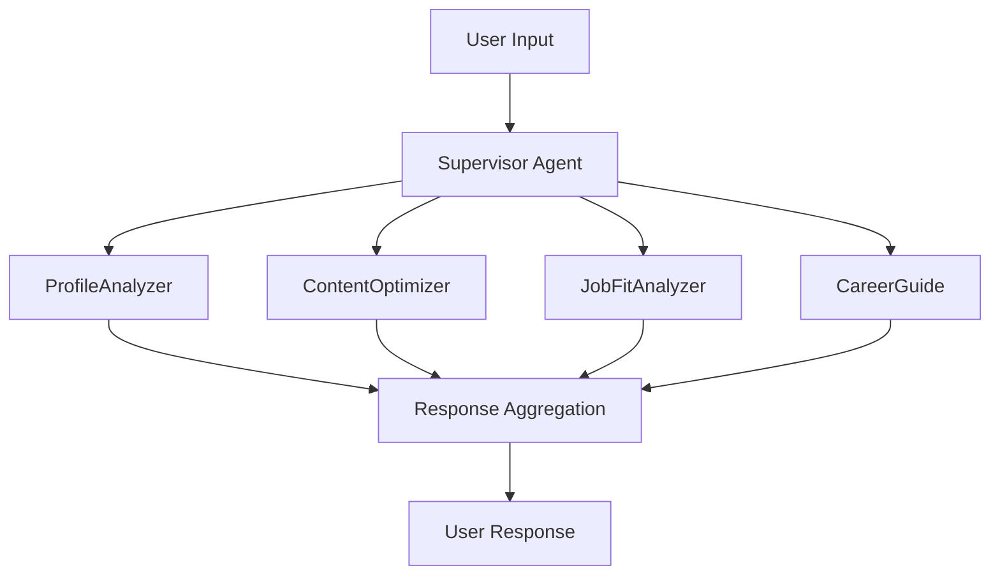

# Linked-Squad-Lamatic

> **⚠️ SETUP REQUIRED**: Before using this project, please see [SETUP.md](SETUP.md) for required configuration steps. The config.yaml file contains placeholders that must be replaced with your actual credentials.

Linked-Squad-Lamatic is an intelligent multi-agent AI system that revolutionizes LinkedIn profile optimization. Built on the Lamatic.ai platform, it employs four specialized AI agents working in harmony to analyze, optimize, and guide your professional LinkedIn journey.

## Features

### **Four Specialized AI Agents**

#### 1. **ProfileAnalyzer**
- **Comprehensive Profile Analysis**: Evaluates your LinkedIn profile completeness (0-100% scoring)
- **Issue Identification**: Pinpoints specific areas needing improvement
- **Actionable Recommendations**: Provides top 3 targeted suggestions for enhancement

#### 2. **ContentOptimizer**
- **Headline Optimization**: Crafts compelling, keyword-rich headlines
- **Summary Enhancement**: Rewrites professional summaries for maximum impact
- **Content Strategy**: Incorporates industry best practices and SEO optimization

#### 3. **JobFitAnalyzer**
- **Compatibility Scoring**: Measures profile-job fit (0-100% compatibility)
- **Skills Gap Analysis**: Identifies missing skills required for target roles
- **Improvement Roadmap**: Provides actionable steps to enhance job candidacy

#### 4. **CareerGuide**
- **Personalized Career Advice**: Tailored guidance based on your profile and goals
- **Skill Development Priorities**: Recommends top skills to develop
- **Strategic Next Steps**: Provides immediate actionable career moves

### **Intelligent Orchestration**
- **Smart Routing**: Supervisor agent intelligently routes requests to appropriate specialists
- **Context Awareness**: Maintains conversation history and cross-agent memory
- **Progressive Workflow**: Guides users through logical optimization steps

### **Interactive Chat Interface**
- **User-Friendly Widget**: Clean, branded chat interface
- **Quick Suggestions**: Pre-built prompts for common requests
- **Real-Time Analysis**: Instant feedback and recommendations

## Architecture

### **System Components**

- **Chat Trigger Node**: Handles user interactions and maintains session state
- **Supervisor Agent**: Central orchestrator managing agent routing and workflow
- **Specialized Agents**: Four domain-specific AI agents with structured outputs
- **Response Handler**: Aggregates and formats final responses

## Getting Started

### Prerequisites
- Lamatic.ai account with API access
- Google Gemini API credentials
- Basic understanding of multi-agent systems

### Quick Start

IMPORTANT: Please read SETUP.md first for configuration steps. Do not directly copy the config.yaml file without updating the placeholders.

1. **Import to Lamatic.ai**
   - Copy the updated contents of config.yaml to lamatic's config window located at the top right corner of the Lamatic's workspace.
   - Configure your OpenAI/Gemini API credentials
   - Deploy the flow

2. **Start Using**
   - Access the chat widget on your configured domains
   - Begin with: "Analyze my profile"

## Configuration

### **Agent Customization**
Each agent can be customized through:
- **Prompts**: Modify system and user prompts for specific behavior
- **Schema**: Adjust output structures for different use cases
- **Models**: Switch between different AI models (Gemini, GPT, etc.)

### **Chat Widget Customization**
- **Branding**: Custom colors, logos, and positioning
- **Suggestions**: Modify quick-start prompts
- **Domains**: Configure allowed domains for widget display

## Technical Details

### **Built With**
- **Platform**: Lamatic.ai
- **AI Models**: Google Gemini 2.5 Pro
- **Architecture**: Event-driven multi-agent system
- **Output Format**: Structured JSON responses

### **Key Features**
- **Conversation Memory**: Maintains context across interactions
- **Error Handling**: Graceful fallbacks and user guidance
- **Scalability**: Modular agent architecture for easy expansion
- **Security**: Credential management and domain restrictions

## Contributing

Contributions are welcome! Areas for enhancement:
- Additional specialized agents (NetworkingGuide, IndustryAnalyzer)
- Enhanced conversation memory and personalization
- Integration with LinkedIn API for real-time data
- Advanced analytics and reporting features

## License

This project is licensed under the MIT License - see the [LICENSE](LICENSE) file for details.

## Support

### **Resources**
- **Platform Support**: [Lamatic.ai Documentation](https://lamatic.ai/docs)
- **Related GitHub Repository**: [shre-db/linked-squad](https://github.com/shre-db/linked-squad)

### Contact
- **Maintainers**: [shreyas](shreyasdb99@gmail.com)

---

**Built with [Lamatic.ai](https://lamatic.ai/)**

Last updated: July 26, 2025