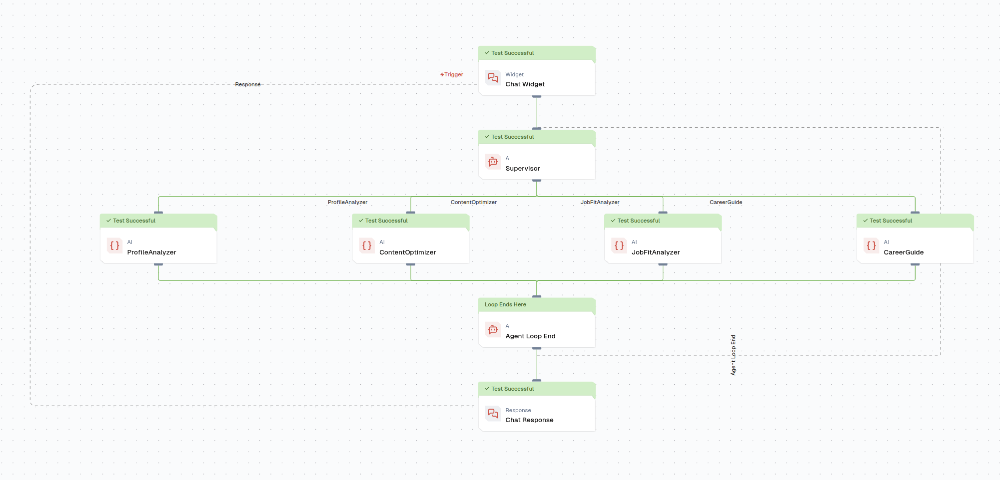
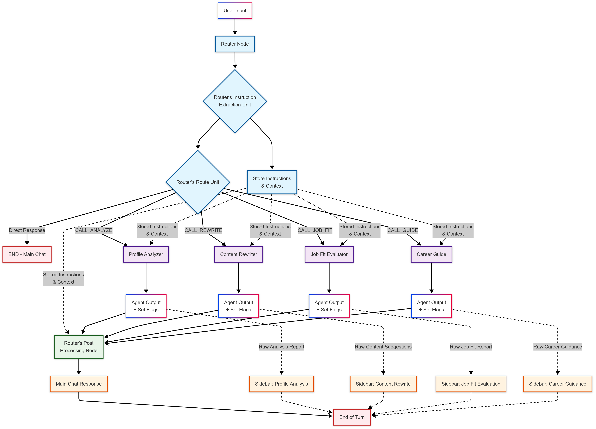

# Review and feedback of Lamatic.ai for building multiagent systems
~ Shreyas

## Should you use Lamatic.ai for building your multiagent system?
Yes and no. Lamatic.ai is a modern, powerful no-code/low-code fully managed platform for building agentic AI systems for your use cases. It is highly customizable, intuitive, and has a wide array of plugins and integrations. I particularly like how Lamatic naturally guides you through the process of building your system, and how it allows you to focus on the logic of your system rather than the technical details. However, it is not a silver bullet and has some limitations. It is not suitable for all use cases, and it may not be the best choice for very complex systems or systems that require a lot of customizations, and careful state management. Below you will find a side by side comparison of Lamatic.ai and LangGraph, a sophisticated open source framework for building highly customizable multiagent systems.

## Lamatic.ai vs LangGraph

### 1. An important distinction
**Lamatic.ai** currently supports 4 types of agents:
1. **Text Agent**: For text-based tasks, such as chatbots or text analysis.
2. **JSON Agent**: For structured data processing, such as data extraction or transformation.
3. **Multi Modal Agent**: For tasks that involve multiple data types, such as images and text.
4. **Supervisor Agent**: For overseeing and managing other agents, ensuring they work together effectively.

The one that I particularly want to focus on is the Supervisor Agent. It allows you to create complex workflows (with some caveats) by orchestrating multiple agents. In the supervisor agent's system prompt, you describe in natural language how the orchestration should work, and Lamatic will handle the rest. This is really convenient.
Here is an example of a supervisor agent's system prompt in a research assistant use case:
```
You are the supervisor of a research based blog writer, which customises their content based on the tone preferred by the users. The following is the ideal flow in which you have to get tasks done from your subordinates agent teams :
    1. Once you are given the topic and tone, you first have to use the researcher team to fetch content based on topic.
    2. Next, you are suppose to give the content from the research team to the writer team and they will give you the writer blog.
    3. Finally, you are suppose to send the tone and content given by the writing team to fetch the final output from the editor team

The ideal order is : Researcher -> Writer -> Editor
Make sure you do the research first, then write it and only then send it to the edit team, once you get an answer from the editor, you can stop the execution of the flow. Make sure the last node you use is always an Editor and try not to break this chain.
In the end, you just need to give blog in markdown text straight away, no need for any leading statements.
```
As per my understanding, the sequence/graph is enforced and interpreted entirely in natural language, which allows flexibility but trades off reliability and precise control over the flow. Why? Because the system prompt is interpreted by a language model which being a stochastic system may not always follow the exact sequence or logic you expect in highly complex scenarios. Lamatic allows inserting code nodes and conditional logic between agents, enabling runtime decisions and some degree of state handling. However, even with these, the supervisor's internal orchestration depends on an LLM's natural language and implicit reasoning capabilities, not explicit state transitions. Therefore, reliability and determinism of agent orchestration is not guaranteed. So, most business and even complex AI orchestration workflows can be built using Lamatic.ai perhaps with human-in-the-loop setup.

**Real-world Example**: In building a LinkedSquad clone (5-agent career assistance system), Lamatic.ai successfully handled complex multi-agent workflows including profile analysis, content optimization, job matching, and career guidance - demonstrating its capability for sophisticated business logic when properly configured.

I faced minor inconveniences with Lamatic's environment. Abrupt and premature termination of the flow with the a message "No agent found, breaking loop". This issue was consistent when using supervisor agent especially with models like gemini 1.5 and 2.5 flash. I could not find a way to prevent this as I do not have control over the underlying orchestration logic. However, a simple follow-up message like "Please try again" worked around this issue.


**LangGraph**, on the other hand, is an open-source framework that allows you to build highly customizable multiagent systems with more control over the orchestration and management of agents. It requires coding knowledge and has a steeper learning curve, but it offers greater flexibility and reliability for complex systems when used with state management utilities such as Pydantic. Since the states are programmatically defined, you can ensure that the agents follow the exact sequence and logic you want, which is crucial for high stakes applications.

Here is an illustration of how you can architect a multiagent system in LangGraph:


### 2. Quick recap of flow and state management in Lamatic.ai vs LangGraph
- Lamatic.ai -> Relies on natural language prompts for flow and state management, which can lead to flexibility but also unpredictability in complex scenarios.
- LangGraph -> Uses programmatically defined states and graphs, allowing for precise control and reliability in agent orchestration.

### 3. Other distinctions

| Feature/Aspect          | Lamatic.ai                                                                 | LangGraph                                                                 |
|-------------------------|---------------------------------------------------------------------------|---------------------------------------------------------------------------|
| Customization           | Highly customizable with plugins and integrations                        | Open-source, highly customizable through code                             |
| Ease of Use             | No-code/low-code interface, user-friendly                                | Requires coding knowledge, steeper learning curve                        |
| Agent Management        | Built-in agent orchestration and management                               | Manual agent management and orchestration                                |
| Integration              | Wide array of integrations available                                     | Flexible integration options, but may require more effort               |
| Community Support       | Growing community, official support available                            | Established open-source community, extensive documentation               |


## When to use Lamatic.ai?
- If you prefer a user-friendly, no-code/low-code solution to build agentic AI systems quickly and easily, Lamatic.ai is a great choice.
- If your use case involves simple to moderately complex workflows that can be managed with natural language prompts, Lamatic.ai is suitable.
- Extensive plugins and integrations are available, making it easy to connect with other services and tools.
- Excellent deployment and scaling capabilities, allowing you to focus on building your system without worrying about infrastructure.

## When to use LangGraph?
- If you need precise control over the orchestration and management of agents, especially in complex systems, LangGraph is the better choice.
- If you are comfortable with coding and want to build highly customizable multiagent systems, LangGraph offers greater flexibility.
- If your use case requires strict state management, logic checks, and dynamic instructions, LangGraph is more reliable.
- If you prefer to self-host and have full control over your system, LangGraph being open-source is a better fit.

## Conclusion
Both platforms serve important but different needs in the multiagent AI ecosystem. Lamatic.ai excels in rapid prototyping and deployment of moderately complex systems, while LangGraph provides the precision control needed for mission-critical applications. The choice depends on your team's technical expertise, system complexity requirements, and control preferences.

## Things I Pondered
- Lamatic.ai -> Reliance on natural language prompts for flow and state management leading to higher flexibility.
- LangGraph -> State Machines and programmatic control for precise orchestration.

What if we invent a hybrid model, say "soft state machines", that combines the flexibility of natural language with the reliability of programmatic control? In such a setup, the state manager acts as an advisory layer, providing guidance and structure while allowing the system to adapt dynamically based on natural language inputs. This could potentially offer the best of both worlds, enabling complex workflows with a more intuitive interface.

## Related Repositories
- [shre-db/linked-squad](https://github.com/shre-db/linked-squad)

## Next Steps
- Explore `README.md` and `SETUP.md` for detailed instructions on using Linked-Squad through Lamatic.ai.
